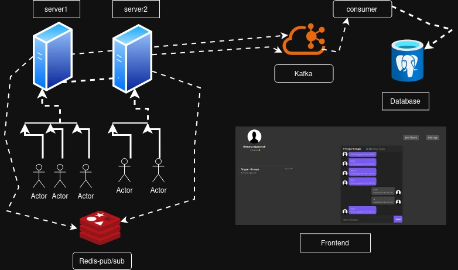

# **Varta: The Ultimate Chat App Backend**

---

### **Architecture Overview**



---

### **Features**

1. Users can crud **private or public groups**.
2. **Room owners** can invite other users to their private rooms.
3. Users can **send and receive messages in real time**.
4. **End to End** encrypted messages

---

### **Technology Stack**

1. **Multiple EC2 instances** to support a **stateless architecture**.
2. **Redis Pub/Sub** for instant real-time message delivery across multiple EC2 instances.
3. **Kafka** for handling **database-level message creation and event streaming**.
4. **Task workers** for managing **background jobs** with **RabbitMq** such as push notifications, email services, and database updates.
5. **PostgreSQL** as the **ultimate source of truth**.
6. **Caching layer** for **blazing-fast API responses** and optimized database queries.
7. **Rate limiter** to **safeguard APIs and server resources**.
8. **Centralized logging** for improved **monitoring and debugging** of the entire application.

---

### **Upcoming Features (November Release)**

1. **React frontend** for a modern and responsive user interface.
2. **Video streaming and calling** support.

---

### **Setup Instructions**

#### **Install Packages**

Run the following command to install dependencies:

```bash
uv sync
```

#### **Project Setup**

Refer to the `.env.example` file and create your own `.env` file locally to configure environment variables for a successful project setup.

---

